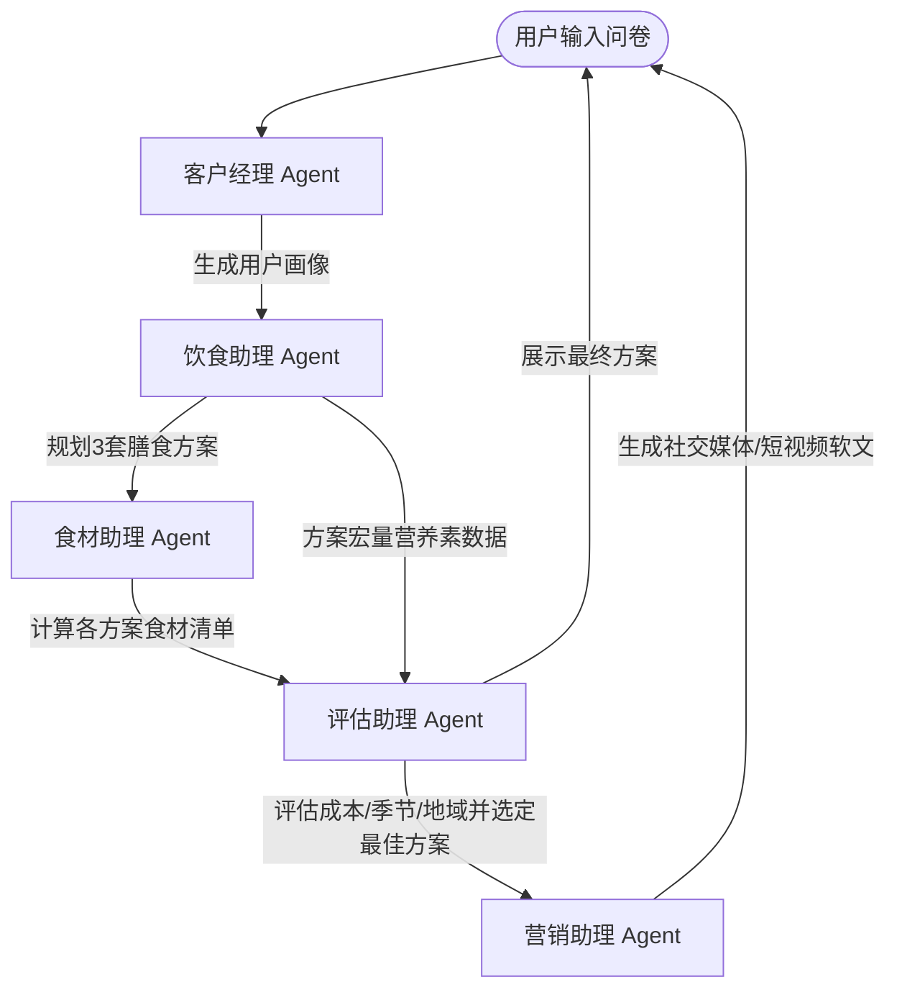

# 多智能体健康饮食规划系统 - 实施计划

本项目将构建一个高度互动、美观、功能齐全的单页 Web 应用（SPA），模拟客户经理、饮食助理、食材助理、评估助理和营销助理这五个 AI 智能体协同工作的全流程，为用户提供量身定制的健康饮食规划。

## 用户评审要求

- **设计美学**：使用深色/浅色高阶质感设计，配合毛玻璃效果（Glassmorphism）、微交互动画和响应式布局，营造出顶级的视觉体验。
- **协同日志可视化**：底部或侧边提供实时智能体协同控制台日志，展示智能体之间的对话和数据传递过程，使用户能直观地看到“多智能体如何协同”。
- **无外部重度依赖**：图表、卡片和动画均使用原生 CSS/SVG 实现，确保零卡顿、极速加载和完全的可定制性。

---

## 智能体协作流程设计

1. **客户经理 (Customer Manager)**：
   - **输入**：用户基本信息（年龄、性别、身高、体重、活动量、目标、饮食禁忌、地域偏好等）。
   - **输出**：结构化的用户画像卡片。
2. **饮食助理 (Diet Assistant)**：
   - **输入**：用户画像。
   - **输出**：3个不同的饮食方案（如：均衡膳食方案、高蛋白低碳方案、夏季清爽地中海方案），每个方案包含热量、营养素配比及一日三餐/加餐建议。
3. **食材助理 (Ingredient Assistant)**：
   - **输入**：3个饮食方案。
   - **输出**：为每个方案生成的分类食材采购清单（肉蛋奶、蔬菜水果、谷物、调味品等），包含预估重量和储存建议。
4. **评估助理 (Evaluation Assistant)**：
   - **输入**：饮食方案 + 食材清单 + 用户偏好。
   - **输出**：从成本、季节匹配度、地域匹配度三个维度对方案进行量化评估（雷达图/对比条形图形式展示），并基于权重自动推荐最终方案。
5. **营销助理 (Marketing Assistant)**：
   - **输入**：最终选定的饮食方案。
   - **输出**：生成适用于不同平台（小红书、抖音视频脚本、微信公众号）的营销软文及推广文案。

---

## 界面与交互设计

项目采用现代仪表盘（Dashboard）布局，分为三个主要区域：
1. **左侧导航与智能体拓扑图 (Sidebar & Agent Topology)**：
   - 展示智能体的连接状态、当前正在工作的智能体（高亮呼吸灯效果）以及当前进度。
2. **主工作区 (Main Content Area)**：
   - 随步骤动态切换的交互组件。
   - **步骤 1**：精美表单问卷，包含滑动条、多选按钮等。
   - **步骤 2**：展示 3 套饮食方案卡片，搭配 SVG 营养配比饼图。
   - **步骤 3**：食材清单清单，带复选框，可折叠查看。
   - **步骤 4**：多维度评估面板，展示动态条形图，显示自动评估过程和最终选定。
   - **步骤 5**：营销内容输出，包含小红书（带表情和标签）、抖音脚本（分镜头设计），支持一键复制。
3. **底部实时协同日志 (Agent Collaboration Console)**：
   - 模拟智能体后台运行的日志流。随着用户操作，会以打字机效果逐行输出智能体的思考和通信过程，增强“多智能体协同”的沉浸感。

---

## 拟修改/新建的文件

### [NEW] [index.html](file:///Users/bob/Documents/antigravity/elegant-hopper/index.html)
主入口页面。包含 HTML5 语义化结构、侧边栏智能体状态拓扑、主工作区各步骤容器、底部日志控制台及元数据。

### [NEW] [style.css](file:///Users/bob/Documents/antigravity/elegant-hopper/style.css)
系统的主样式表。包含：
- 现代配色系统（深色底色，辅以健康绿 `#10B981`、活力橙 `#F59E0B`、科技蓝 `#3B82F6`）。
- 磨砂玻璃效果（`backdrop-filter: blur(12px)`）和高级阴影。
- 智能体节点动画（呼吸、连接线流动）。
- 响应式栅格与卡片交互。

### [NEW] [app.js](file:///Users/bob/Documents/antigravity/elegant-hopper/app.js)
核心逻辑与智能体模拟：
- 状态管理器：控制当前步骤、表单数据和选定的饮食方案。
- 智能体引擎：模拟 5 个智能体的异步计算、决策与数据传递。
- 动态 UI 渲染：动态生成 SVG 图表、方案卡片和营销内容。
- 日志系统：向底部控制台追加带有智能体特定前缀与颜色的格式化日志。

---

## 验证计划

### 自动验证
1. 打开浏览器审查页面元素，确保没有未处理的脚本错误。
2. 检查响应式布局在移动端和 PC 端的适配情况。
3. 验证表单的输入校验功能是否正常。

### 手动验证步骤
1. 打开系统，填写健康问卷，点击“生成用户画像”。
2. 观察底部日志是否开始打印 `[客户经理]` 的工作日志，左侧智能体状态是否流转。
3. 进入饮食方案生成阶段，点击不同的饮食方案，查看营养素配比及一日三餐卡片。
4. 进入食材清单阶段，勾选和折叠食材，验证交互。
5. 进入评估阶段，调整评估权重（例如偏向“成本”或偏向“季节”），观察推荐方案是否随之改变。
6. 进入营销生成阶段，切换小红书/抖音/微信页签，测试“复制文案”按钮是否正常工作。
